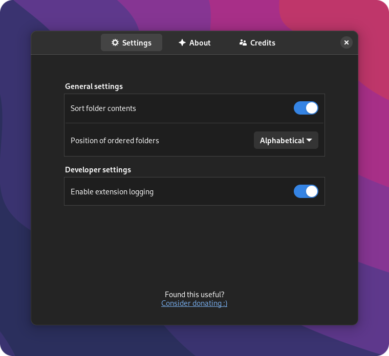

  

## Alphabetical App Grid GNOME Extension

  - Restore the alphabetical ordering of the app grid, removed in GNOME 3.38
  - Supports GNOME 3.38+, earlier versions are untested, and unnecessary
  - Get the extension from [here](https://extensions.gnome.org/extension/4269/alphabetical-app-grid/)
  - This project is licensed under GPL 3.0
  - Any donations are greatly appreciated :)

## Install the extension from releases:
  - Extract the zip to `~/.local/share/gnome-shell/extensions/AlphabeticalAppGrid@stuarthayhurst/`
    - Alternatively: `gnome-extensions install "AlphabeticalAppGrid@stuarthayhurst.shell-extension.zip" --force`
  - Reload GNOME: <kbd>ALT</kbd>+<kbd>F2</kbd>, <kbd>r</kbd>, <kbd>ENTER</kbd>
  - Enable the extension: `gnome-extensions enable AlphabeticalAppGrid@stuarthayhurst`

## Install the extension from source:
  - Make sure the install dependencies are installed
  - `make build`
  - `make install`
  - Reload GNOME: <kbd>ALT</kbd>+<kbd>F2</kbd>, <kbd>r</kbd>, <kbd>ENTER</kbd>
  - Enable the extension: `gnome-extensions enable AlphabeticalAppGrid@stuarthayhurst`

## Build system usage:
  - ### Common targets: Regular build system targets to build, install and uninstall
    - `make build`: Compiles GSettings schemas and creates extension zip
    - `make check`: Runs checks on built extension zip
    - `make install`: Installs the extension
    - `make uninstall`: Uninstalls the extension
  - ### Development targets: These targets are aimed at developers and translators
    - `make clean`: Deletes extension zip, `locale` and automatic backups
    - `make gtk4`: Simplifies and converts UI files (Should be run after any changes to files in `ui/`)
      - Supports multiple threads (`-j$(nproc)`)
    - `make translations`: Updates translations
    - `make compress`: Losslessly compresses any .pngs in `docs/`
      - Allows passing `COMPRESSLEVEL="-o[X]"`, where `[X]` is an integer between 0-7
    - `make release`: Updates the GTK 4 UI, translations, then creates and checks an extension zip
      - Calls `make gtk4 translations compress build check`
      - Supports any variables / arguments supported by these targets
      - Also allows passing `VERSION="[XX]"`, where `[XX]` is the version to update `metadata.json` to
    - `make package`: Creates the extension zip from the project's current state (Only useful for debugging)

## Install dependencies:
  - gettext
  - gnome-shell (`gnome-extensions` command)
  - libglib2.0-bin

## Build dependencies: (Only required if running `make release`)
  - `All install dependencies`
  - sed (`make translations`)
  - libgtk-3-bin (`make gtk4`)
  - libgtk-4-bin (`make gtk4`)
  - optipng (`make compress`)

## What happened to the show favourites option?
  - Maintaining this feature was going to end up complicated and messy
  - It was also out of scope, and [this](https://extensions.gnome.org/extension/4485/favourites-in-appgrid/) extension did the job better
  - With this in mind, the feature was removed in release `v16`

## Want to help?
  - Help with the project is always appreciated, refer to `docs/CONTRIBUTING.md` to get started
  - [Documentation](docs/CONTRIBUTING.md#documentation-changes), [code](docs/CONTRIBUTING.md#code-changes), [translations](docs/CONTRIBUTING.md#translations) and UI improvements are all welcome!

## Bug reporting / debugging:
  - If you were simply told "Error" while installing, reboot and if there's still an issue
    - When installing an extension from GNOME's extension site, this is normal
  - A log of what the extension is doing is very helpful for fixing issues
  - The extension logs to the system logs when enabled, which can be accessed with `journalctl /usr/bin/gnome-shell`
  - A live feed of GNOME's logs can be accessed with `journalctl /usr/bin/gnome-shell -f -o cat`
  - To enable logging, the setting can be found under the `Developer settings` section of the extension's settings:
  

### Credits:
  - `scripts/update-po.sh` and `scripts/update-pot.sh` were derived from [Fly-Pie](https://github.com/Schneegans/Fly-Pie), originally licensed under the [MIT license](https://github.com/Schneegans/Fly-Pie/blob/develop/LICENSE)

### Screenshots:

